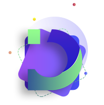

[![Discord][discord-shield]][discord-url]


<!-- PROJECT LOGO -->
<br />
<p align="center">
  <a href="https://diora.network/">
    
  </a>

  <h3 align="center">Diora Network</h3>

  <p align="center">
    Diora Network is a incentivised smart contract parachain, utilizing advanced PoSM with Double Validation for security guarantees
    <br />
    <a href="https://diora.network/docs"><strong>Explore the docs »</strong></a>
    <br />
    <br />
    <a href="https://diora.network/">View Demo</a>
    ·
    <a href="https://github.com/diora-network/diora/issues">Report Bug</a>
    ·
    <a href="https://github.com/diora-network/diora/issues">Request Feature</a>
    ·
    <a href="https://github.com/diora-network/diora/pulls">Send a Pull Request</a>
  </p>
</p>


<!-- TABLE OF CONTENTS -->
## Table of Contents

* [About the Project](#about-the-project)
* [Devnet](#built-with)
* [Running Diora](#getting-started)
* [Contributing](#contributing)
* [Contact](#contact)
* [Acknowledgements](#acknowledgements)


## About The Project

https://user-images.githubusercontent.com/49777543/168764160-121147ce-78c3-4e77-a020-5e03df8e6e06.mp4

Diora is built with Substrate which natively supports EVM, WASM (soon) and a multi-layer sharding scaling solution if needed.

The main goal of Diora Network is to foster an array of diverse and sustainable cross-chain applications by empowering and rewarding developers that build on the network with baked in incentives and rewards

Diora rewards developers based on the value and impact of their dapp, rather than their close association or connections to capital. Unlike existing versions of older layer 1s where tokens are mostly concentrated in the hands of the first few early participants Diora is designed to be shared across all contributors, users and stakeholders.


## Devnet Chain Specs

The Devnet is a public early access testnet to validate the technical architecture and security of our blockchain in a setting that is as realistic as possible.

Chain ID
```
201
```
RPC
```
https://testnet.diora.network/
```
Websocket
```
https://dev.diora.network/
```


<!-- GETTING STARTED -->
## Getting Started

Launch a local setup including a Relay Chain and a Parachain

* polkadot & diora
```
# 1. Compile Polkadot
git clone https://github.com/paritytech/polkadot
git checkout release-v0.9.38
cargo build --release

# 2. Compile Diora
https://github.com/Diora-Network/Diora
cargo build --release

# 3. Copy polkadot binary to Diora/script 
```
By make command 

```
# Start diora local
# After the relay chain produces 10 blocks, the parachain starts producing blocks
make start-diora chain=diora_local

# Restart diora local
make restart-diora chain=diora_local

# Stop diora local
make stop-chain

# Stop chain and remove chain data
make remove-chain
```


# Launch the multi-chain
```
polkdot-launch ./diora/polkadot-launch/config.json
```

<!-- USAGE EXAMPLES -->
## Usage


Facuet

Wallets

Dex


<!-- CONTRIBUTING -->
## 🤝 Contributing

Contributions are what make the DioraDAO such an amazing place to be learn, inspire, and create. Any contributions you make are **extremely appreciated**.

1. Fork the Project
2. Create your Feature Branch (`git checkout -b feature/AmazingFeature`)
3. Commit your Changes (`git commit -m 'Add some AmazingFeature'`)
4. Push to the Branch (`git push origin feature/AmazingFeature`)
5. Open a Pull Request


<!-- LICENSE -->
## 📝 License 

Distributed under the MIT License. See `LICENSE` for more information.


<!-- CONTACT -->
## 📫 Contact

Diora Network - [@DioraNetwork](https://twitter.com/dioranetwork) - contact@diora.network

Project Link: [https://github.com/diora-network/diora](https://github.com/diora-network/diora)


<!-- ACKNOWLEDGEMENTS -->
## Acknowledgements
* [Purestake](https://purestake.io)
* [Astar](https://astar.newtwork)
* [ORML]()


<!-- MARKDOWN LINKS & IMAGES -->
<!-- https://www.markdownguide.org/basic-syntax/#reference-style-links -->
[discord-shield]: https://img.shields.io/badge/contact-us-blue?logo=discord&logoColor=white
[discord-url]: https://discord.gg/2bVwpwF9aq

